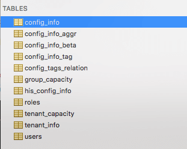
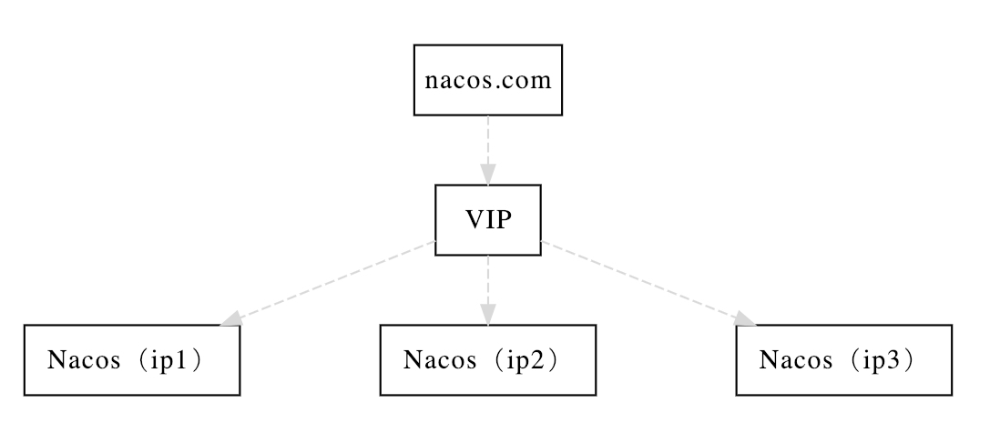
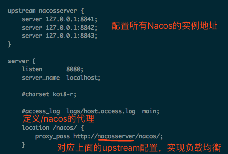

# ** Running Nacos In Production **

## Nacos Cluster

### 1 Data Persistence:

#### 1.1 install and config Database:
install the database and execute the sql file.  
And the sql schema create file(For example: nacos-mysql.sql) was in the nacos server conf folder.  

  

modify the conf/application.properties
```
spring.datasource.platform=mysql

db.num=1
db.url.0=jdbc:mysql://localhost:3306/nacos?characterEncoding=utf8&connectTimeout=1000&socketTimeout=3000&autoReconnect=true
db.user=root
db.password=
```

#### 1.2 reference
深入思考
关于Nacos数据的持久化实现，与其他的中间件相比，在实现上并没有采用分布式算法来解决一致性问题，而是采用了比较常规的集中化存储来实现。由于采用单一数据源的方式，直接解决了分布式一致性问题，所以从学习成本的角度上来说，Nacos的实现原理会更容易被理解和接受。但是，从部署的负责度和硬件投入成本上来说，与etcd、consul、zookeeper这些通过算法方式解决一致性问题的中间件相比，就显得不足了。

同时，在引入MySQL的存储时，由于多了一个中间件的存在，整个Nacos系统的整体可用性一定是会所有下降的。所以为了弥补可用性的下降，在生产上MySQL的高可用部署也是必须的，成本再次提高。不论如何提高，可用性都难以达到100%，所以这种方式，不论如何提升存储的可用性，理论上都会对Nacos集群的自身可用性造成微小的下降。

以上思考主要从理论上，粗略讨论的，并没有经过详细的成本评估与可用性计算。所以，对于实际应用场景下，可能这些成本的增加和可用性的降低并没有那么多大的影响。同时，Spring Cloud Alibaba下使用的各开源组件都有对应的商业产品，在没有足够运维人力的团队下，使用对应的商业产品可能从各方面都会更加划算。

### 2 Nacos Cluster:
This is a sample Architecture Design For Nacos Cluster

  

#### 2.1 install and config Database:
The same steps as 1.1 step

#### 2.2 config Nacos Cluster:
a.copy the cluster.conf.sample to cluster.conf   
```
cd /usr/local/nacos/config
cp cluster.conf.example cluster.conf
```

b.modify cluster.confg
```
#ip:port
140.143.249.219:8848
140.143.249.220:8848
140.143.249.221:8848
```

c.startup the nacos service in all of the server node
```
sh startup.sh
```

d.Using nginx or VIP to proxy the nacos servers  
  

### 3 Some questions

#### 3.1 install and config Database:
```
2019-02-20 16:20:53,216 INFO The host [nacos_server] is not valid
 Note: further occurrences of request parsing errors will be logged at DEBUG level.

java.lang.IllegalArgumentException: The character [_] is never valid in a domain name.
	at org.apache.tomcat.util.http.parser.HttpParser$DomainParseState.next(HttpParser.java:926)
	at org.apache.tomcat.util.http.parser.HttpParser.readHostDomainName(HttpParser.java:822)
	at org.apache.tomcat.util.http.parser.Host.parse(Host.java:71)
	at org.apache.tomcat.util.http.parser.Host.parse(Host.java:45)
	at org.apache.coyote.AbstractProcessor.parseHost(AbstractProcessor.java:288)
	at org.apache.coyote.http11.Http11Processor.prepareRequest(Http11Processor.java:809)
	at org.apache.coyote.http11.Http11Processor.service(Http11Processor.java:384)
	at org.apache.coyote.AbstractProcessorLight.process(AbstractProcessorLight.java:66)
	at org.apache.coyote.AbstractProtocol$ConnectionHandler.process(AbstractProtocol.java:791)
	at org.apache.tomcat.util.net.NioEndpoint$SocketProcessor.doRun(NioEndpoint.java:1417)
	at org.apache.tomcat.util.net.SocketProcessorBase.run(SocketProcessorBase.java:49)
	at java.util.concurrent.ThreadPoolExecutor.runWorker(ThreadPoolExecutor.java:1149)
	at java.util.concurrent.ThreadPoolExecutor$Worker.run(ThreadPoolExecutor.java:624)
	at org.apache.tomcat.util.threads.TaskThread$WrappingRunnable.run(TaskThread.java:61)
	at java.lang.Thread.run(Thread.java:748)
```
主要原因是，一开始在配置upstream的时候，用了nacos_server作为名称，而在Nacos使用的Tomcat版本中不支持_符号出现在域名位置，所以上面截图给出的upstream的名称是nacosserver，去掉了_符号。  

到这里，Nacos的集群搭建就完成了！我们可以通过Nginx配置的代理地址：http://localhost:8080/nacos/来访问Nacos，在Spring Cloud应用中也可以用这个地址来作为注册中心和配置中心的访问地址来配置。  

